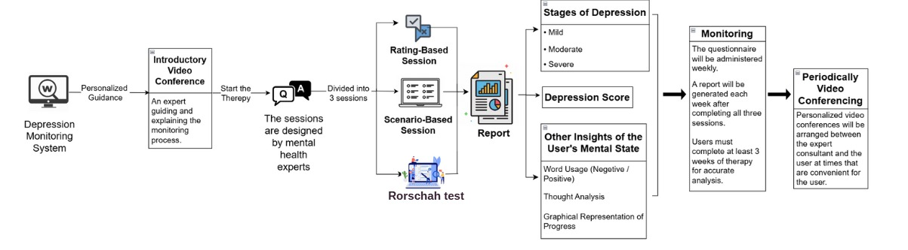

# HealingNeuro - A Depression Monitoring System🌟

 

## Overview  
The **Depression Monitoring System (DMS)** is a web-based application designed for organizations to assist **psychotherapists** in monitoring and predicting depression levels, promoting mental well-being in alignment with **UN Sustainable Development Goal 3 (Good Health and Well-Being)**. By leveraging **Natural Language Processing (NLP)** and **Machine Learning (ML)**, DMS provides an AI-driven approach to detecting depression and offering personalized recovery resources. The system features **1-to-1 personalized video conferencing with mental health experts**, allowing real-time guidance and support. Additionally, it incorporates a **three-session weekly assessment** with diverse question formats to ensure comprehensive evaluation. It offers real-time emotional analysis through a browser interface and Chrome extension.

**Report Link**
https://drive.google.com/drive/folders/1wkWgtGkAlXkPMBx3bplsKSy5blDH8pJU

**Models Files**
https://drive.google.com/drive/folders/1VJ_mNjkMSad1xg9gKLCM_OfXyWwyhhJP

**PPT Link**
https://drive.google.com/drive/folders/1wd3xpYApJlrqYtKRXCcbm5q-LLs-zewG?usp=sharing

 

## Objectives
* **Enhance Early Detection:** Develop a reliable self-assessment tool that identifies depressive symptoms promptly using structured questionnaires.
* **Facilitate Personalized Insights:** Generate tailored reports that provide users with a clear understanding of their mental health status.
* **Promote Continuous Monitoring :** Implement a system for weekly assessments and web extension to track changes in mental health over time and adjust recommendations accordingly.
* **Utilize Evidence-Based Methods:** Incorporate validated psychological assessments, including rating scales, scenario evaluations, and the Thematic Apperception Test (TAT) for comprehensive insights.

 

## Key Features  
**1. Three-Part Assessment:**
* Rating Session: Users rate their feelings to measure depression severity.
* Scenario Session: Users respond to life situations to reveal emotional patterns.
* Rorschach Session: Users tell stories from images to uncover hidden thoughts.

**2. Personalized Reports:** 
Detailed feedback including

* Depression Stage: Mild, Moderate, or Severe.
* Depression Score: A number showing the current mental state.
* Insights: Analysis of language and thought patterns through graphical visualizations.

**3. Weekly Monitoring by professionals:**
Regular assessments and 1:1 video calls with professionals to track changes in mental health.
Updated reports reflecting progress or decline.

## Features
- Text-based depression monitoring using machine learning and deep learning models
- Real-time and continuous monitoring through a Chrome extension
- Depression level prediction based on user interactions and online behavior
- Interactive dashboard displaying activity logs and mental health risk indicators
- Expert-driven recommendations and mental health support suggestions
- User-friendly interface that is easy to access and navigate
- Cost-effective solution designed for wide accessibility

## Tech Stack
**Frontend**:
- HTML
- CSS
- JavaScript

**Backend**:
- Node.js
- Express.js
- Flask (for model inference APIs)

**Machine Learning / Deep Learning**:
- Scikit-learn(svc)
- TensorFlow / Keras
- Natural Language Processing (NLP)(Bert)

**Others**:
- Chrome Extension (JavaScript, manifest v3)
- sqlite database
- Deepseek R1's API for real time suggestions
- Git,Python 3

**Architecture**

Web Application Workflow:

Chrome Extension User Workflow and Technical Workflow

